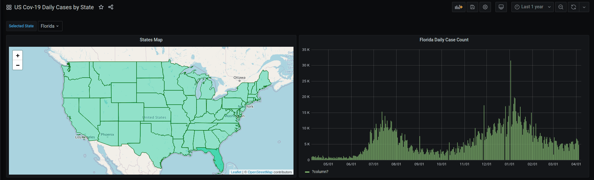

# Map Select Panel for Grafana

MSP is a Grafana (>= 7.0) panel plugin for selecting features (like a point or an area) on a geographic map.

Why yet another map panel for Grafana when there are already [so many](https://github.com/panodata/grafana-map-panel/issues/20)? Most map panels are visualizing data on a map for monitoring purposes. Instead I needed a map panel for selecting geographic features that would capture the current selection as a dashboard variable in order to update the data shown in other panels (think selecting a sensor from a map and automatically updating a timeseries graph with its measurements). I couldn't find a panel that would do this, so I hacked [Track Map Panel](https://github.com/alexandrainst/alexandra-trackmap-panel) to do what I needed. 

## Features
- Background map from a configurable tile server (see panel parameter _Tileserver url_).
- Draws GeoJSON _Points_, _Polygons_ and _Multipolygons_ on top of the map. 
- Size for point markers as well as colors for polygons are configurable through panel parameters. 
- Clicking on a feature sets the dashboard variable _selected_ to the corresponding _id_ value. 

## Documentation

### Install
- Clone this repository into the `plugins` directory of your Grafana installation
- Restart Grafana and find the panel under your available panel visualizations. 

Alternatively, you can run Grafana inside a Docker container and mount the repository to `/var/lib/grafana/plugins/map-select-panel`.

## Acknowledgements
- Based on [Track Map Panel](https://github.com/alexandrainst/alexandra-trackmap-panel)
- Using [Grafana Toolkit](https://github.com/grafana/grafana/tree/master/packages/grafana-toolkit)
- Icon made by [Freepik](https://www.freepik.com) from [Flaticon](https://www.flaticon.com/)

## License
The MIT License (MIT)